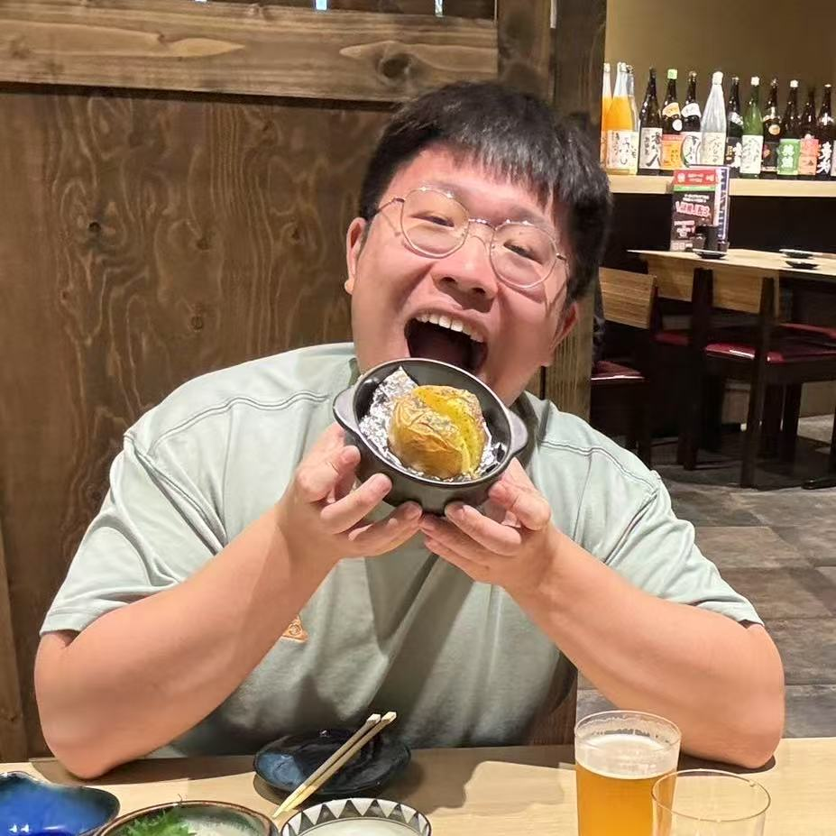

<!-- # **Yunrui Lu** -->

## About Me
{: style="border-top: none; border-bottom: none; box-shadow: none; margin-top: 0;" }

  

Hi! My name is Yunrui Lu. I'm a Bioengineering PhD student at Caltech. Previously, I worked at Cedars Sinai and Dartmouth Hitchcock Medical Center as research associate. I graduated from Dartmouth College in 2022 with Master degree in Quantitative Biomedical Science, and from Xiamen University, China in 2021 with Bachelor degrees in German Language and Literature and Mathematical Economics.

I'm interested in developing ML methods using single cell and spatial transcriptomics to explore tumor heterogeneity and cell cell communication in tumor immune microenvironment.

  yunruilu[at]caltech.edu / <a href="https://scholar.google.com/citations?user=EOIS4IgAAAAJ&hl=en">Google Scholar</a> / <a href="https://github.com/LutzzLu">Github</a>

<!-- --- -->

## Publications
1. **Publication Title 1**  
   _Author(s)_, **Journal/Conference**, Year.  
   [Link to paper (if available)](#)

2. **Publication Title 2**  
   _Author(s)_, **Journal/Conference**, Year.  
   [Link to paper (if available)](#)

3. **Publication Title 3**  
   _Author(s)_, **Journal/Conference**, Year.  
   [Link to paper (if available)](#)

*(Add or remove publication entries as needed.)*

<!-- --- -->

## Find Me Elsewhere
- [Google Scholar](https://scholar.google.com/citations?user=XXXXXX) <!-- Replace XXXXXX with your Google Scholar ID or link -->
- [Curriculum Vitae (PDF)](cv.pdf) <!-- Make sure you have a cv.pdf file in your repo -->
- [LinkedIn](https://www.linkedin.com/in/your-profile) <!-- Optional additional links -->
- [Twitter](https://twitter.com/yourhandle) <!-- Optional additional links -->

<!-- --- -->

## Contact
Feel free to [email me](mailto:your_email@example.com) for any questions, collaborations, or discussions.

